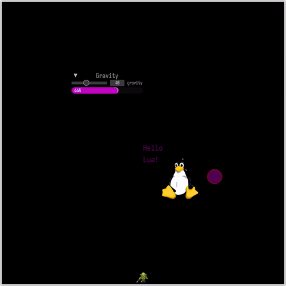

# 🕹️ Fool Engine

> A lightweight and flexible script-driven 2D game engine built with Rust + Lua, supporting multithreading, physics simulation, and UI systems.



---

## ✨ Features

- ⚙️ **Rust-driven with Lua scripting logic**
- 🧠 **Multithreaded Lua module execution**, synchronized with the main thread
- 🎨 **Vector graphics and image rendering powered by Vello**
- 🧊 **Integrated Egui UI system**, supporting most layout and control components
- ⚡ **Rapier2D physics simulation** with dynamic interaction
- 🔁 **Module dependency + state snapshot system**, modular and reusable

---

## 🔧 Tech Stack

| Category | Technology |
|---------|------------|
| Rendering | [Vello](https://github.com/linebender/vello) + [wgpu](https://github.com/gfx-rs/wgpu) |
| Scripting | [mlua](https://github.com/khvzak/mlua) + Lua 5.4 |
| UI | [egui](https://github.com/emilk/egui) |
| Physics | [Rapier2D](https://rapier.rs/) |
| Windowing | [winit](https://github.com/rust-windowing/winit) |

---

## 🚀 Getting Started

### 📦 Build Requirements

- Rust 1.76+ nightly

```bash
# Clone the repository
git clone https://github.com/wszxl516/fool-engine.git
cd fool-engine

# Run the demo
cargo r -p fool-engine --features=debug 
